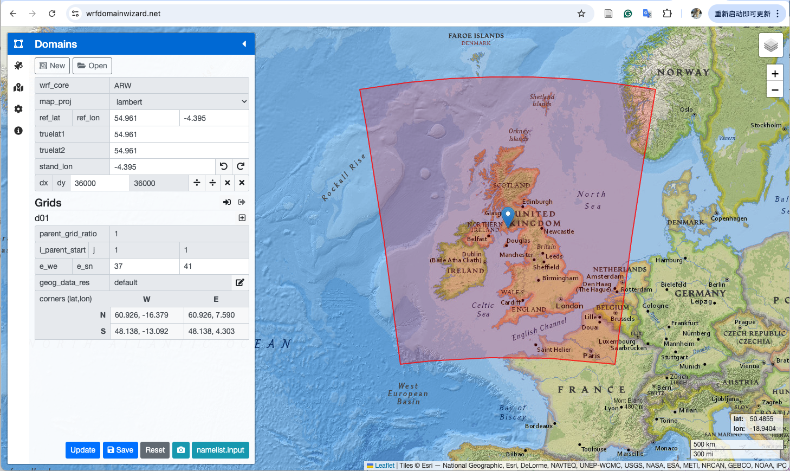

# 2 Input Data

The following scripts are provided by the author for creating input data for a **single-domain** simulation. Instructions for generating input data for nested, multi-domain simulations are described in a separate section.

```bash
export CASE_DIR=${WRF_ROOT}/cases/
export CASENAME=TestSingleDomain
export CASEINPUT_DIR=${CASE_DIR}${CASENAME}/input/
export WPSINPUT_DIR=${CASEINPUT_DIR}wps/
export CTSMINPUT_DIR=${CASEINPUT_DIR}ctsm/
export WRFINPUT_DIR=${CASEINPUT_DIR}wrf/
```


## 2.1 Define A Single Domain

- Go to [https://wrfdomainwizard.net/](https://wrfdomainwizard.net/)

  - Modify grid parameters
  - For example, grid spacing `dx`, `dy`. 36000 means 3.6 km. 

  

- Click the `save` button at the bottom to save the `namelist.input` 
- Or, click `namelist.input` button to get content

## 2.2 Run WPS

Please refer to official resources:

- [WPS user guide](https://www2.mmm.ucar.edu/wrf/users/wrf_users_guide/build/html/wps.html)
- [WRF-ARW online tutorials](https://www2.mmm.ucar.edu/wrf/OnLineTutorial/)

Running WPS with `namelist.wps` should generate `met_em.d01.*` and `geo_em.d01.nc`

## 2.3 Run `create_scrip_file.ncl`

```bash
cd ${WRF_ROOT}/${WRFNAME}/${CTSMNAME}/tools/contrib/
ln -sf ${WPSINPUT_DIR}geo_em.d01.nc .
ncl create_scrip_file.ncl > ${CTSMINPUT_DIR}/create_scrip_file.log 2>&1
mv *nc ${CTSMINPUT_DIR}
rm geo_em.d01.nc
```

- If run successfully, `wrf2clm_land.nc` and `wrf2clm_ocean.nc` should be created.

- Then, unstructure the `wrf2cl_land.nc` to get unstructured mesh files. 

  ```bash
  cd ${CTSMINPUT_DIR}
  export ESMF=${ESMFDIR}/bin
  export GRIDFILE=wrf2clm_land.nc
  export LANDMESHFILE=lnd_mesh.nc
  ${ESMF}/ESMF_Scrip2Unstruct ${GRIDFILE} ${LANDMESHFILE} 0
  ncap2 -s 'elementMask(:)=0' ${LANDMESHFILE} mask_${LANDMESHFILE} --overwrite
  ```

  - If run successfully, `lnd_mesh.nc` and `mask_lnd_mesh.nc` should be created

## 2.4 Run `mkunitymap.ncl`

```bash
cd ${WRF_ROOT}/${WRFNAME}/${CTSMNAME}/tools/site_and_regional/
export GRIDFILE1=${CTSMINPUT_DIR}/wrf2clm_ocean.nc
export GRIDFILE2=${CTSMINPUT_DIR}/wrf2clm_land.nc
export MAPFILE=${CTSMINPUT_DIR}/wrf2clm_mapping.nc
PRINT=TRUE
ncl mkunitymap.ncl > ${CTSMINPUT_DIR}/mkunitymap.log 2>&1
```

- If run successfully, `wrf2clm_mapping.nc` should be created.

Then, unstructure the file:

```bash
cd ${CTSMINPUT_DIR}
export ESMF=${ESMFDIR}/bin
export GRIDFILE=wrf2clm_land.nc
export LANDMESHFILE=lnd_mesh.nc
${ESMF}/ESMF_Scrip2Unstruct ${GRIDFILE} ${LANDMESHFILE} 0
ncap2 -s 'elementMask(:)=0' ${LANDMESHFILE} mask_${LANDMESHFILE} --overwrite
```

- Check `PET0.ESMF_logFile` to see if `ESMF_Scrip2Unstruct` works successfully.


## 2.5 Run `gen_domain`

```bash
cd ${WRF_ROOT}/${WRFNAME}/${CTSMNAME}/tools/mapping/gen_domain_files
./gen_domain -m ${CTSMINPUT_DIR}/wrf2clm_mapping.nc -o wrf2clm_ocn_noneg -l wrf2clm_lnd_noneg > ${runs_ctsm}/gen_domain.log 2>&1
mv domain.* ${CTSMINPUT_DIR}
```

- If run successfully, three files should be created as follows (`250510` is the date of running):
  - `domain.lnd.wrf2clm_lnd_noneg_wrf2clm_ocn_noneg.250510.nc`
  - `domain.ocn.wrf2clm_lnd_noneg_wrf2clm_ocn_noneg.250510.nc`
  - `domain.ocn.wrf2clm_ocn_noneg.250510.nc`

## 2.6 Run `gen_mksurfdata_namelist`

```bash
# activate a Python virtual environment
source /home/yuansun/.venv/bin/activate

cd ${WRF_ROOT}/${WRFNAME}/${CTSMNAME}/tools/mksurfdata_esmf
export START_YEAR=2022
export END_YEAR=2022
export INPUT_PATH=${CESM_ROOT}/cesm_inputdata
export RES=3.6x3.6
./gen_mksurfdata_namelist --start-year ${START_YEAR} --end-year ${END_YEAR} --res ${RES} --model-mesh ${runs_ctsm}/${LANDMESHFILE} --rawdata-dir ${INPUT_PATH} --model-mesh-nx 60 --model-mesh-ny 81 > gen_mksurfdata_namelist.log 2>&1
mv surfdata* ${CTSMINPUT_DIR}
```

- `model-mesh-nx` is equal to `e_we`-1 from the `namelist.wps` and `model-mesh-ny`  as `e_sn`-1.
- If run successfully, `surfdata.namelist` should be created.
- Note: `if start-year > 2023 must add an --ssp_rcp argument that is not none: valid opts for ssp-rcp are {'ssp-rcp': ['SSP1-2.6', 'SSP3-7.0', 'SSP5-3.4', 'SSP2-4.5', 'SSP1-1.9', 'SSP4-3.4', 'SSP4-6.0', 'SSP5-8.5', 'none']}`


## 2.7 Run `mksurfdata_esmf`

- Download raw data required in `surfdata.namelist` for creating CTSM surface data from [CESM raw data svn](https://svn-ccsm-inputdata.cgd.ucar.edu/trunk/inputdata/lnd/clm2/rawdata/)

- Create a job script to run `mksurfdata_esmf` (taking hours), for example, 

  ```bash
  #!/bin/bash
  # This script is used for make surface region in Archer2
  
  #SBATCH --job-name mksurfdata_jobscript_single
  #SBATCH --partition=standard
  #SBATCH --qos=long
  #SBATCH --account=
  #SBATCH --time=48:00:00
  #SBATCH --nodes=1
  #SBATCH --ntasks-per-node=1
  #SBATCH --cpus-per-task=128
  #SBATCH --output=mksurfdata_jobscript_single.out
  #SBATCH --error=mksurfdata_jobscript_single.err
  
  export OMP_NUM_THREADS=$SLURM_CPUS_PER_TASK
  export CASENAME=wrf_GM3d
  export WORKDIR=/work/n02/n02/yuansun/wrf/runs/${CASENAME}/configuration/CTSM
  export ESMFTOOL=/work/n02/n02/yuansun/wrf/WRFnoleap-CTSM/CTSMdev/tools/mksurfdata_esmf
  
  cd ${ESMFTOOL}
  . ${ESMFTOOL}/tool_bld/.env_mach_specific.sh
  if [ $? != 0 ]; then echo "Error running env_mach_specific script"; exit -4; fi 
  time srun  --hint=nomultithread --distribution=block:block ${ESMFTOOL}/tool_bld/mksurfdata < ${WORKDIR}/surfdata.namelist 
  if [ $? != 0 ]; then echo "Error running for namelist  ${WORKDIR}/surfdata.namelist"; exit -4; fi 
  echo Successfully ran resolution
  ```

- If run successfully, surface data like `surfdata_1.2x1.2_SSP5-8.5_2022_78pfts_c250607.nc` should be generated with `surfdata_1.2x1.2_SSP5-8.5_2022_78pfts_c250607.log` ended with:

  ```
  Successfully created surface data output file = surfdata_1.2x1.2_SSP5-8.5_2022_78pfts_c250607.nc
     This file contains the land model surface data
  
  Successfully ran mksurfdata_esmf
  ```

- For `END_YEAR`>`START_YEAR`, a time-series land use data should also be created, like `landuse.timeseries_1.2x1.2_SSP5-8.5_2022-2023_78pfts_c250607.nc`.

